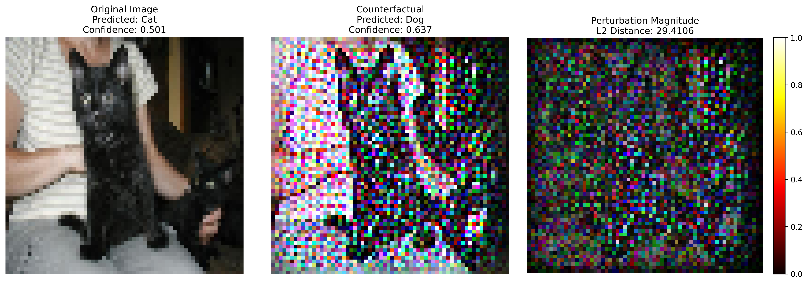

# Image Counterfactual Explanations for Deep Learning

An explainable AI project that generates counterfactual explanations for image classification models using **real Kaggle dataset images** (cats vs dogs).

## Project Overview

This project answers the question: **"What minimal pixel changes would flip an image prediction?"**

### Example:
**For a real cat image classified as "cat," show exactly which pixels need to change to make the model predict "dog"**



*Visual example showing: Original Image (Cat) → Counterfactual (Dog) → Perturbation Heatmap*

## Features

- **CNN Image Classifier**: Deep learning model for cats vs dogs binary classification
- **Real Dataset Only**: Uses Kaggle cats vs dogs dataset with real images (no synthetic fallbacks)
- **Gradient-based Counterfactuals**: Find minimal pixel perturbations that flip predictions
- **Comprehensive Evaluation**: Measure counterfactual quality with proximity, sparsity, and validity metrics
- **Production Ready**: Clean codebase with proper error handling and validation

## Project Structure

```
Counterfactual/
├── src/
│   ├── models/
│   │   └── cnn_classifier.py        # CNN for cats vs dogs classification
│   ├── counterfactuals/
│   │   └── gradient_based.py        # Gradient-based counterfactual generation
│   ├── utils/
│   │   ├── data_loader.py           # Real image data loader (Kaggle dataset)
│   │   ├── visualization.py         # Counterfactual visualization
│   │   └── metrics.py               # Evaluation metrics
│   ├── config.py                    # Configuration settings
│   └── __init__.py                  # Package initialization
├── data/
│   └── kaggle_cats_dogs/            # Real images (download from Kaggle)
│       ├── Cat/                     # Cat images
│       └── Dog/                     # Dog images
├── models/                          # Saved trained models
├── results/                         # Generated counterfactual results
├── .gitignore                       # Git ignore rules
├── requirements.txt                 # Python dependencies
└── README.md                        # This file
```

   │   └── ...
## How to use

Follow these steps to run the project end-to-end on your machine. These commands assume you are using a Python virtual environment and are running from the project root (`Counterfactual/`).

1) Create and activate a virtual environment (optional but recommended)

```powershell
python -m venv .venv
.\.venv\Scripts\Activate.ps1
```

2) Install Python dependencies

```powershell
pip install -r requirements.txt
```

3) Download and prepare the dataset

1. Go to: https://www.kaggle.com/datasets/bhavikjikadara/dog-and-cat-classification-dataset
2. Download and extract the dataset.
3. Ensure the folder structure matches:

```
data/kaggle_cats_dogs/
├── Cat/
│   ├── 1.jpg
│   └── ...
└── Dog/
    ├── 1.jpg
    └── ...
```

4) (Optional) If you use Kaggle CLI to download the dataset, you can run:

```powershell
4. **Optimize with dual objectives**:
   - Proximity loss: Keep changes minimal (L2 distance)
   - Sparsity loss: Change as few pixels as possible (L1 distance)
5. **Generate counterfactual** showing exactly what changed

```

5) Train the model (short demo) or load an existing model

```powershell
### Algorithm
```
For each iteration:

Notes:
- `main.py` runs a short demo by default (trains on a reduced subset for speed). Edit `main.py` to change training epochs, batch size, or which images are used for demonstration.
- Training on a full dataset or running longer experiments requires more time and memory; consider running on a GPU-enabled machine.

6) View generated visualizations

After `main.py` finishes, example visualizations are saved in `results/`:

- `results/counterfactual_example.png` — single example (Original → CF → Heatmap)
- `results/counterfactual_batch.png` — multiple examples in a grid

Open the folder in File Explorer or use the terminal:

```powershell
  1. Compute model prediction gradient
  2. Update perturbation to move toward target class
  3. Apply proximity and sparsity constraints

7) Tips and customization

- To increase counterfactual quality, adjust `GradientBasedCounterfactuals` parameters (e.g., `max_iterations`, loss weights) in `src/counterfactuals/gradient_based.py` or via the `main.py` call.
- To run on more images, change the `test_images` slice in `main.py`.
- To save additional outputs, extend `src/utils/visualization.py` and call the desired plotting function in `main.py`.

```

## Evaluation Metrics

- **Validity**: Does the counterfactual achieve the target class?
- **Proximity**: L2 distance from original image
- **Sparsity**: L1 distance (number of pixels changed)
- **Success Rate**: Percentage of successful counterfactual generations

## Why This Matters

### Explainable AI in Action
- **Transparency**: See exactly what the model "looks for" in real images
- **Debugging**: Understand model decision boundaries
- **Trust**: Verify that models make sensible distinctions between cats and dogs
- **Education**: Visual learning about deep learning internals

---

**Built with**: TensorFlow, Keras, OpenCV, NumPy, Matplotlib